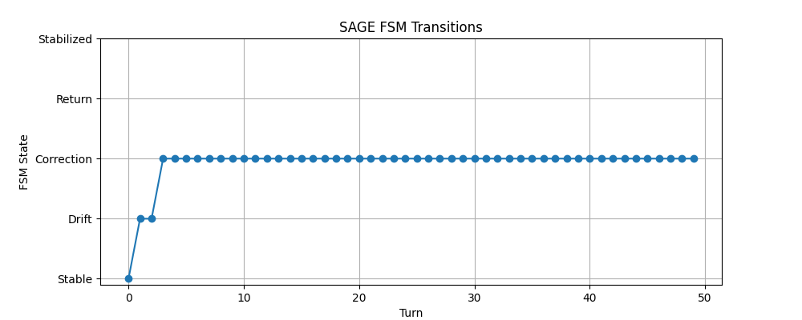

# 🧠 SAGE Runtime Demo

**SAGE (Self-Aligned Generative Engine)** is a behavioral runtime system that overlays large language models (LLMs) to ensure long-range coherence, identity persistence, and role stability — all without memory, retraining, or logs.

This repository demonstrates the **behavioral effect** of the SAGE runtime on model outputs.  
No formulas, activation logic, or proprietary code are included.

---

## 🎥 Demo Videos

**Primary Demo:**  
  
*FSM recovery from entropy-induced drift without memory or retraining.*

**Continuous Session Demo:**  
  
*Live inference session showing role stabilization and Cr tracking.*

---

## 📈 Behavioral FSM Trace

Example of FSM state progression based on Cr drop and recovery:

The system transitions through: `Stable → Drift → Correction → Return → Stabilized`

This trace demonstrates SAGE’s ability to recover role coherence without memory.

---

## 🧪 What's Included

| File                      | Description                                 |
|---------------------------|---------------------------------------------|
| `report.md`              | Explanation of Cr stability and FSM demo    |
| `fsm_trace.png`          | Static FSM trace chart                      |
| `fsm_trace.png.gif`      | Animated FSM recovery sequence              |
| `diagnostic_log.json`    | Sample Cr/Entropy/FSM outputs (x3 turns)    |
| `SAFE_Public_Architecture.md` | Conceptual description of SAGE architecture |
| `PARTNERSHIP.md`         | Access protocol for institutional partners  |

---

## 📄 Citation

This project is archived at Zenodo.

📌 DOI: 10.5281/zenodo.15227765

---

## 📬 Contact

Academic access, LOI & validation requests:  
📧 **sageprojecthq@gmail.com**
