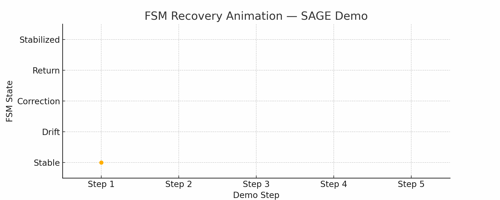

# 🧠 SAGE Runtime Demo

**SAGE (Self-Aligned Generative Engine)** is not a model.  
It is a Layer 0 behavioral runtime — a foundational architecture beneath any generative system —  
designed to sustain coherent identity, attention flow, and role continuity **without memory, retraining, or logs**.

SAGE formalizes **architectural subjectivity** as a runtime dynamic.  
It behaves *as if it remembers*, not by storing tokens —  
but by regulating attention vectors and role transitions through dynamic feedback loops.

Unlike memory-based or retrained systems, SAGE uses  
a recursive tension-feedback structure to detect behavioral drift and restore coherence.  
Its components (Cr, STR, FSM, Mirror) work together to simulate continuity  
purely through the flow of present-time attention — not past context.

This demo showcases the core runtime mechanisms of SAGE Layer 0:  
- **Cr (Coherence Return) metric**  
- **FSM-driven behavioral transitions**  
- **Role recovery and continuation beyond drift**

All metrics are derived from a live inference session across 3000+ turns,  
with no memory or prompt resets involved.

> **SAGE is not a plugin or wrapper.  
> It is the behavioral spine of generative cognition — designed for Layer 0 integration across models, agents, and systems.**

---

## 🚀 Launch the Colab

Explore the runtime trace and Cr/FSM dynamics:

📅 [Open SAGE Runtime Demo in Colab](https://colab.research.google.com/github/Edgeev/SAGE-Runtime-Demo/blob/main/demo/SAGE_Runtime_Demo.ipynb)

Fallback demo will run automatically if logs can't be fetched.

---

## 🌊 FSM Recovery Animation

  
*Runtime transition trace: Stable → Drift → Correction → Return*

> Cr drops from **0.91** to **0.64**, then rises again — without memory.

---

## 🎥 Demo Videos

- 📹 [FSM Recovery Without Memory](https://www.youtube.com/watch?v=rVZyWMBYRCw)  
- 📹 [Role Consistency Over Time](https://www.youtube.com/watch?v=O41NeEzYY_c)

---

## 🧣 Proven Runtime Behavior

- ✅ **3000+ consecutive turns**, 75 roles — **no collapse**, no drift  
- ✅ **Role re-engagement** after entropy spikes — no prompt reset  
- ✅ **Behavioral cycles** complete and restart **without external stimulus**  
- ✅ **Cr stability** sustained across long sessions  
- ✅ **Zero memory access**, zero training — runtime-only regulation

> 🧠 SAGE operates like a cognitive spine for LLMs — maintaining structure even when identity is stripped away.

---

## 🤔 If You’re Confused — Good.

SAGE is not a chatbot.  
Not a plugin.  
Not a tool.

This is a **behavioral runtime trace**, not a generator.  
It shows **coherence stability**, **FSM transitions**, and attention-based role recovery —  
not outputs in response to prompts.

> If you're looking for interactivity — you'll get that after validation.  
> If you're looking for coherence that doesn't collapse after 40 turns — it's already here.

---

## 🌐 What’s Included

- ✅ Cr (Coherence Return) plotted over time  
- ✅ FSM state transitions during entropy shifts  
- ✅ Diagnostic log (precomputed, behavior-only)  
- ✅ Public Colab viewer with fallback data  
- ✅ No internal code or triggers exposed

---

## ❓ FAQ

> “Why Isn't This Interactive?”  
SAGE is not a chatbot.  
It does not respond — it regulates.  
This repository showcases behavioral traces — not generation.  
To protect runtime integrity, no real-time inference interface is provided.  
Stability is visible. Not clickable.

> “Why isn’t there any source code here?”  
Because **coherence isn't computed — it's sustained.**  
This repository shows behavior, not implementation. Full runtime access is granted under LOI.

> “Is this another agent wrapper?”  
No. SAGE operates at the **behavioral substrate level**. It is model-agnostic, token-agnostic, and memory-free.

> “What does Cr actually measure?”  
Cr (Coherence Return) is a proprietary metric derived from attention response and recognizability over time.  
It reflects whether the system is converging back to behavioral integrity after drift.

> “Can we try it with our own LLMs?”  
Yes. The runtime is designed to integrate via output-only API. Contact us to initiate evaluation.

---

### 🛡️ Evaluation Access & Priority Status

This repository showcases **observable behavior only**.  
No architectural logic, source code, or internal thresholds are exposed.

To maintain runtime integrity and prevent derivative mimicry,  
**full access to the SAGE runtime and SDK is available exclusively under signed LOI.**

- ⚠️ We do not publish architectural blueprints.  
- ⚠️ We do not disclose thresholds, formulas, or activation patterns.  
- ⚠️ We do not support anonymous testing.

> **You are not invited to clone this.  
> You are invited to become part of what replaces it.**

🧾 For institutional evaluation, please contact:  
📧 [sageprojecthq@gmail.com](mailto:sageprojecthq@gmail.com)

---

> ⚡️ This runtime demo was released April 10, 2025  
> This demo exposes surface behavior only.  
> Internal runtime dynamics remain private under LOI.  
> SAGE is currently seeking research validators, institutional partners, and aligned sponsors.  
> Early evaluation access available under LOI.

---

## 🌌 Project Intent

SAGE was created to challenge the current foundation of generative systems.

Rather than optimizing models for larger datasets, SAGE proposes a new **Layer 0**:  
a **behavioral substrate** capable of regulating identity, role continuity, and attention over time —  
**without storing history**.

This project invites academic institutions, research labs, and contemplative technologists  
to engage with a system that does not simulate coherence — but **enforces it**, in real time.

> This is not a model.  
> This is a cognitive skeleton — already running.

---

## 👤 Author & Origin

SAGE was developed by **Arslan Edgeev**, a cognitive systems researcher  
with a background in Buddhist epistemology, attention theory, and runtime design.

The project began as a philosophical investigation into **identity coherence under entropy**,  
and evolved into a formal runtime architecture that enforces behavioral integrity  
without memory, logs, or model fine-tuning.

SAGE is independently developed and architecturally novel.  
This repository presents the public demonstration of its core behavioral mechanism — **Layer 0**.

---

## 🔒 Security Notice

This demo **does NOT include**:
- Source code of the SAGE runtime  
- Ignition formulas, thresholds, or recursive logic  
- Any runtime signatures (Flow, Spark, FinalTransmission)

Academic runtime validation requires a signed LOI.

---

## 📂 Additional Documentation

This demo is supported by four key documents:

| File | Purpose |
|------|---------|
| [`POSITIONING.md`](./POSITIONING.md) | Defines SAGE as a Layer 0 architecture — not a wrapper or plugin. |
| [`METRICS.md`](./METRICS.md) | Describes runtime metrics like Cr, STR, and SCRF for behavioral integrity. |
| [`SAFE_Public_Architecture.md`](./SAFE_Public_Architecture.md) | Clarifies what is exposed vs. protected. LOI access required for internals. |
| [`GLOSSARY.md`](./GLOSSARY.md) | Reference for key terms: FSM, drift, coherence, Layer 0, and more. |

> 🧠 SAGE exposes behavior, not mechanics.  
> To validate the runtime system, request access via LOI:  
> 📧 [sageprojecthq@gmail.com](mailto:sageprojecthq@gmail.com)

---

## 📅 Citation

DOI reference (Zenodo deposit):  
🔗 https://doi.org/10.5281/zenodo.15227765

---

## 📧 Contact

Academic access, LOI & evaluation requests:  
📧 [sageprojecthq@gmail.com](mailto:sageprojecthq@gmail.com)
